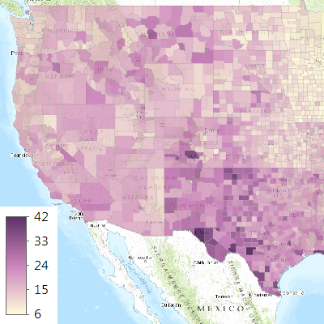
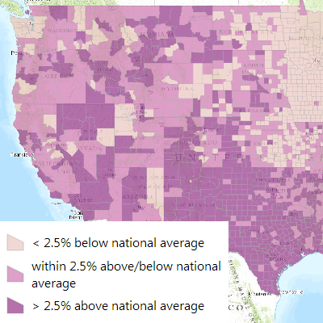

# visualization-js

A collection of samples showing how to use the ArcGIS API for JavaScript to create various visualizations.

To explore these samples, you can:
* Click any thumbnail below to see a live sample
* Click the title under a thumbnail to view code

## Samples

### Basic

||||
|:-:|:-:|:-:|
|[Simple map](basic_simple_map)|[Add data](basic_add_data)|[Use renderer (simple)](basic_use_renderer)|

### Show Unique Values

||||
|:-:|:-:|:-:|
|[Unique value renderer](unique_simple)|[With legend](unique_simple_with_legend)|[With function conversion](unique_conversion)|

### Enhancement Options

||||
|:-:|:-:|:-:|
|[InfoTemplate (Pop-up)](enhance_infotemplate)|[InfoTemplate (Pop-up) with custom function](enhance_infotemplate_function)|[Legend](enhance_legend)|
||||
|[Trigger actions on click](enhance_click)|||

### Show Data by Color

||||
|:-:|:-:|:-:|
|[Show data values by color](color_simple)|[Focus on a narrower range](color_focus)|[Use stops](color_stops)|
||||
|[Classify data](color_classed)|||

## Resources

* [ArcGIS API for JavaScript](https://developers.arcgis.com/javascript/)
* [ArcGIS Blog](http://blogs.esri.com/esri/arcgis/)
* [twitter@esri](http://twitter.com/esri)

## Issues

Find a bug or want to request a new feature?  Please let us know by submitting an issue.

## Contributing

Esri welcomes contributions from anyone and everyone. Please see our [guidelines for contributing](https://github.com/esri/contributing).

## Licensing
Copyright 2014 Esri

Licensed under the Apache License, Version 2.0 (the "License");
you may not use this file except in compliance with the License.
You may obtain a copy of the License at

   http://www.apache.org/licenses/LICENSE-2.0

Unless required by applicable law or agreed to in writing, software
distributed under the License is distributed on an "AS IS" BASIS,
WITHOUT WARRANTIES OR CONDITIONS OF ANY KIND, either express or implied.
See the License for the specific language governing permissions and
limitations under the License.

A copy of the license is available in the repository's [license.txt](license.txt) file.

​
