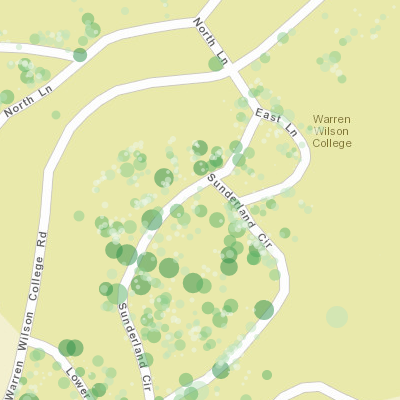

# size_real

[View Code](https://developers.arcgis.com/javascript/jssamples/renderer_proportional_points.html) | [Live Sample](https://developers.arcgis.com/javascript/samples/renderer_proportional_points/)

Mapping data in real-world unit with their actual sizes on map.

)
