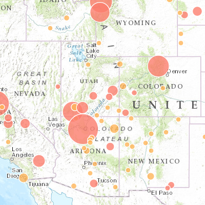

# size_uniquevalue

[View Code](index.html) | [Live Sample](https://esri.github.io/visualization-js/size_uniquevalue)

Mapping data by both size and unique value. Showing number of visitors at each national park service site in 2013, with national parks and national monuments in different colors.

)
