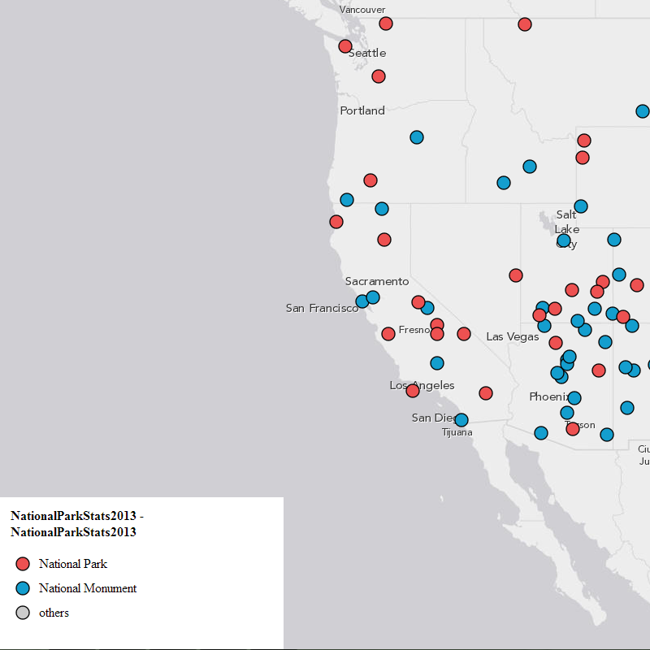

# unique_simple_with_legend

[View Code](index.html) | [Live Sample](https://esri.github.io/visualization-js/unique_simple_with_legend)

Style data with unique value renderer and add legend to the map.

